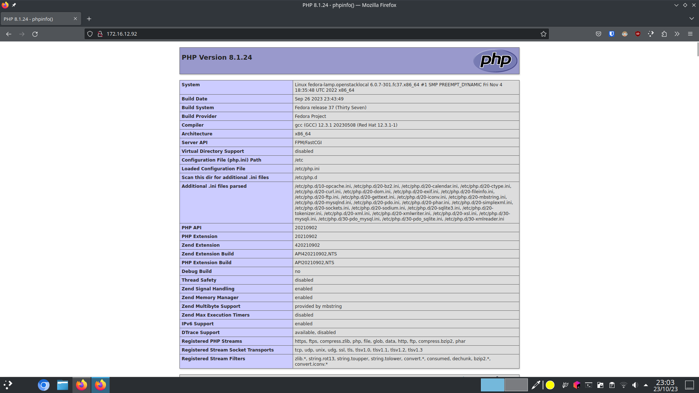

# Práctica LAMP Fedora

## Archivo de instalación
Creamos la carpeta scripts y el archivo install_lamp.sh

Además, cambiamos los permisos del archivo para permitir su ejecución con `chmod u+x scripts/install_lamp.sh`


Por último, ejecutaremos el script con 
```bash
cd scripts
sudo ./install_lamp.sh
```

